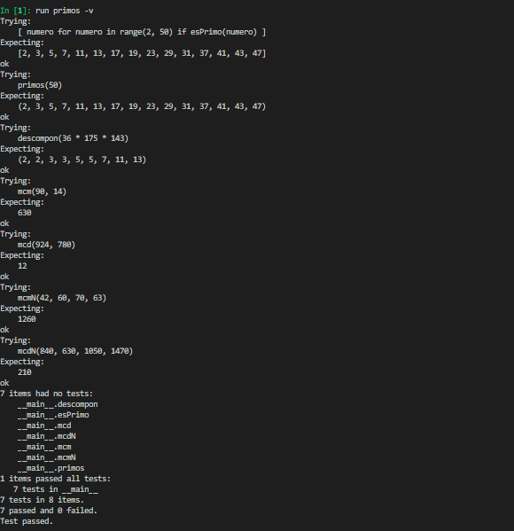

# Segunda tarea de APA 2023: Manejo de números primos

## Nom i cognoms: Marta Enrich Garcia

## Fichero `primos.py`

- El alumno debe escribir el fichero `primos.py` que incorporará distintas funciones relacionadas con el manejo
  de los números primos.

- El fichero debe incluir una cadena de documentación que incluirá el nombre del alumno y los tests unitarios
  de las funciones incluidas.

- Cada función deberá incluir su propia cadena de documentación que indicará el cometido de la función, los
  argumentos de la misma y la salida proporcionada.

- Se valorará lo pythónico de la solución; en concreto, su claridad y sencillez, y el uso de los estándares marcados
  por PEP-8. También se valorará su eficiencia computacional.

### Determinación de la *primalidad* y descomposición de un número en factores primos

Incluya en el fichero `primos.py` las tres funciones siguientes:

- `esPrimo(numero)`   Devuelve `True` si su argumento es primo, y `False` si no lo es.
- `primos(numero)`    Devuelve una **tupla** con todos los números primos menores que su argumento.
- `descompon(numero)` Devuelve una **tupla** con la descomposición en factores primos de su argumento.

### Obtención del mínimo común múltiplo y el máximo común divisor

Usando las tres funciones del apartado anterior (y cualquier otra que considere conveniente añadir), escriba otras
dos que calculen el máximo común divisor y el mínimo común múltiplo de sus argumentos:

- `mcm(numero1, numero2)`:  Devuelve el mínimo común múltiplo de sus argumentos.
- `mcd(numero1, numero2)`:  Devuelve el máximo común divisor de sus argumentos.

Estas dos funciones deben cumplir las condiciones siguientes:

- Aunque se trate de una solución sub-óptima, en ambos casos deberá partirse de la descomposición en factores
  primos de los argumentos usando las funciones del apartado anterior.

- Aunque también sea sub-óptimo desde el punto de vista de la programación, ninguna de las dos funciones puede
  depender de la otra; cada una debe programarse por separado.

### Obtención del mínimo común múltiplo y el máximo común divisor para un número arbitrario de argumentos

Escriba las funciones `mcmN()` y `mcdN()`, que calculan el mínimo común múltiplo y el máximo común divisor para un
número arbitrario de argumentos:

- `mcmN(*numeros)`:  Devuelve el mínimo común múltiplo de sus argumentos.
- `mcdN(*numeros)`:  Devuelve el máximo común divisor de sus argumentos.

### Tests unitarios

La cadena de documentación del fichero debe incluir los tests unitarios de las cinco funciones. En concreto, deberán
comprobarse las siguientes condiciones:

- `esPrimo(numero)`:  Al ejecutar `[ numero for numero in range(2, 50) if esPrimo(numero) ]`, la salida debe ser
                      `[2, 3, 5, 7, 11, 13, 17, 19, 23, 29, 31, 37, 41, 43, 47]`.
- `primos(numeor)`: Al ejecutar `primos(50)`, la salida debe ser `(2, 3, 5, 7, 11, 13, 17, 19, 23, 29, 31, 37, 41, 43, 47)`.
- `descompon(numero)`: Al ejecutar `descompon(36 * 175 * 143)`, la salida debe ser `(2, 2, 3, 3, 5, 5, 7, 11, 13)`.
- `mcm(num1, num2)`: Al ejecutar `mcm(90, 14)`, la salida debe ser `630`.
- `mcd(num1, num2)`: Al ejecutar `mcd(924, 780)`, la salida debe ser `12`.
- `mcmN(numeros)`: Al ejecutar `mcm(42, 60, 70, 63)`, la salida debe ser `1260`.
- `mcdN(numeros)`: Al ejecutar `mcd(840, 630, 1050, 1470)`, la salida debe ser `210`.

### Entrega

#### Ejecución de los tests unitarios

Inserte a continuación una captura de pantalla que muestre el resultado de ejecutar el fichero `primos.py` con la opción
*verbosa*, de manera que se muestre el resultado de la ejecución de los tests unitarios.



#### Código desarrollado

Inserte a continuación el contenido del fichero `primos.py` usando los comandos necesarios para que se realice el
realce sintáctico en Python del mismo.

```
"""
MARTA ENRICH GARCIA

Módulo de gestión de números primos

PRIMOS I DESCOMPON està canviat a llista

Exemples:

>>> [ numero for numero in range(2, 50) if esPrimo(numero) ]
[2, 3, 5, 7, 11, 13, 17, 19, 23, 29, 31, 37, 41, 43, 47]

>>> primos(50)
(2, 3, 5, 7, 11, 13, 17, 19, 23, 29, 31, 37, 41, 43, 47)

>>> descompon(36 * 175 * 143)
(2, 2, 3, 3, 5, 5, 7, 11, 13)

>>> mcm(90, 14)
630

>>> mcd(924, 780)
12

>>> mcmN(42, 60, 70, 63)
1260

>>> mcdN(840, 630, 1050, 1470)
210
"""

def esPrimo(numero):
    """
    Devuelve true si su argumento es primo, y False si no lo es.  
    """

    if numero < 2:
        return False
    for i in range(2, int(numero**0.5)+1):
        if numero % i == 0:
            return False
    return True                         

def primos(numero):
    """
    Devuelve una tupla con todos los números primos menores que su argumento.
    """

    return tuple([prova for prova in range(2, numero) if esPrimo(prova)])

def descompon(numero):
    """
    Devuelve una tupla con la descomposición en factores primos de su argumento.
    """
  
    llista = list()
    for prova in primos(numero):            #Mentre el valor prova damb tots els valors primers dens del rang establert (range(2, numero))
        while numero % prova == 0:          
            llista.append(prova)            
            numero = numero // prova        
    #return llista                           
    return tuple(llista)                   
    
def mcm(num1, num2):
    """
    Devuelve el mínimo común múltiplo de sus argumentos.
    """
    
    A = list(descompon(num1))             #S'obtenen els valors de a amb la funció descompon
    B = list(descompon(num2))             #S'obtenen els valors de b amb la funció descompon
    for x in A:                     #Per cada valor dins de la llista A
        if x in B:                  #Si aquest valor també està a la llista B
            B.remove(x)             #Eliminem els valors de b que es repeteixen en A
    A = A + B                       #Sumem les dos llistes (no es sumen els valors només s'afegeixen a la llista)
    mcm = 1                         #Creem una variable per el resultat final
    for x in A:                     #Per cada valor dins de la llista A
        mcm = mcm * x               #Multipliquem tots els valors que hi ha dins de la llista
    return mcm                      #Valor final

def mcd(num1, num2):
    """
    Devuelve el máximo común divisor de sus argumentos.
    """

    A = list(descompon(num1))             #S'obtenen els valors de a amb la funció descompon
    B = list(descompon(num2))             #S'obtenen els valors de b amb la funció descompon
    aux = list()                    #Creem una llista nova per poder guardar valors després
    for x in A:                     #Per cada valor de x dins de la llista A
        if x in B:                  #Si aquest valor també està a la llista B
            B.remove(x)             #Eliminem els valors de b que es repeteixen en A
            aux.append(x)           #Guardem el valor en aquesta llista per posterior fer el mcd
    mcd = 1                         #Creem una variable per el resultat final
    for x in aux:                   #Per cada valor dins de la llista A
        mcd = mcd * x               #Multipliquem tots els valors que hi ha dins de la llista

    return mcd                      #Valor final

def mcmN(*numeros):
    """
    Devuelve el mínimo común múltiplo de sus argumentos.
    """
    a = list(numeros)   
    b = []
    for x in a:
        b.append(descompon(x))
    l = len(b)
    A = list(b[0])
    i = 1
    while i < l:
        B = list(b[i])
        for x in A:                     
            if x in B:                  
                B.remove(x)             
        A = A + B  
        i += 1            
    mcm = 1                         
    for x in A:                     
        mcm = mcm * x               
    return mcm                      

def mcdN(*numeros):
    """
    Devuelve el máximo común divisor de sus argumentos.
    """
    lista = list(numeros)
    num1 = int(lista.pop())
    a = descompon(num1)
    c = list()
    while len(lista) > 0:
        num2 = int(lista.pop())
        b = list(descompon(num2))

        for x in a:
            if x in b:
                b.remove(x)
                c.append(x)
        a = c
        c = list()

    mcdN=1
    for x in a:
        mcdN=mcdN*x

    return mcdN

import doctest
doctest.testmod()
```

#### Subida del resultado al repositorio GitHub ¿y *pull-request*?

El fichero `primos.py`, la imagen con la ejecución de los tests unitarios y este mismo fichero, `README.md`, deberán
subirse al repositorio GitHub mediante la orden `git push`. Si los profesores de la asignatura consiguen montar el
sistema a tiempo, la entrega se formalizará realizando un *pull-request* al propietario del repositorio original.

El fichero `README.md` deberá respetar las reglas de los ficheros Markdown y visualizarse correctamente en el repositorio,
incluyendo la imagen con la ejecución de los tests unitarios y el realce sintáctico del código fuente insertado.
